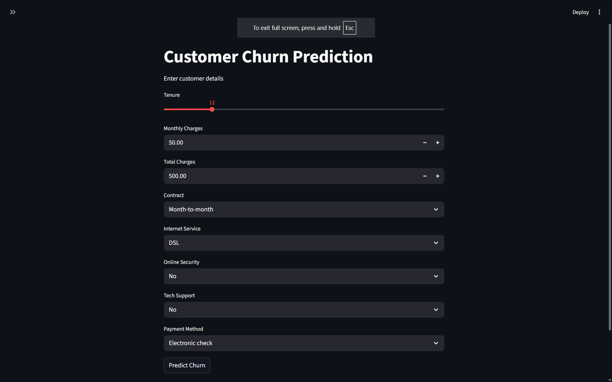
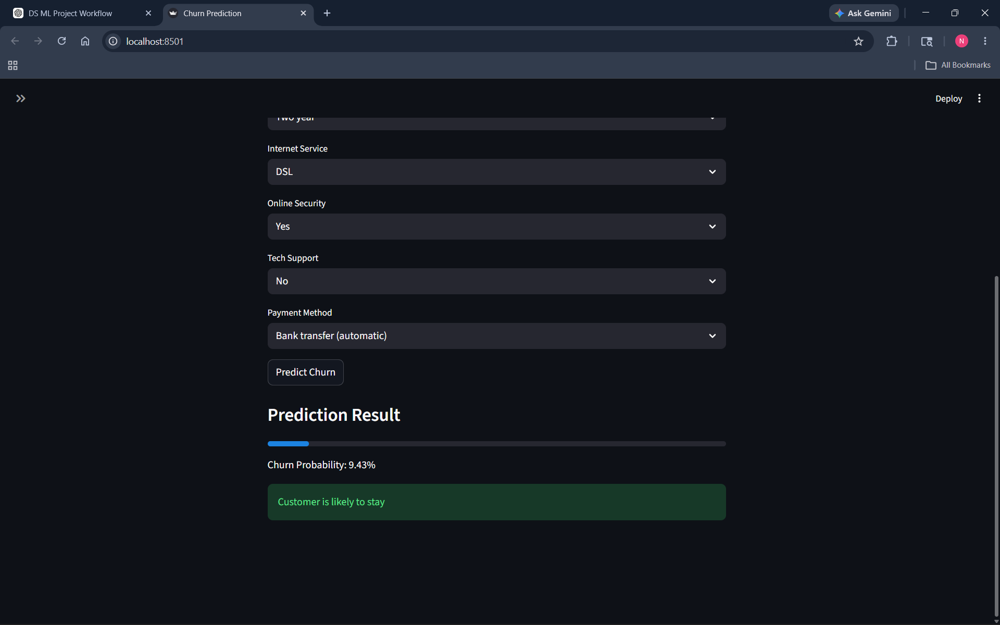
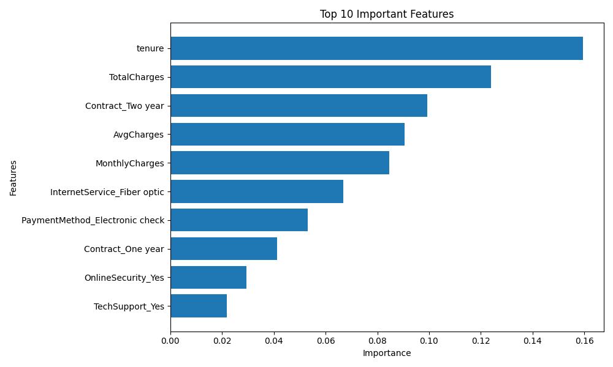

# Customer Churn Prediction

A machine learning web application that predicts whether a telecom customer is likely to churn using a Random Forest Classifier and Streamlit.

---

## Project Overview

Customer churn is one of the major challenges in the telecom industry. This project uses machine learning techniques to analyze customer behavior and predict whether a customer is likely to leave the service.

The application provides:
- Data preprocessing
- Exploratory Data Analysis (EDA)
- Feature engineering
- Model training
- Feature importance analysis
- Live prediction interface using Streamlit

---

## Features

- End-to-end machine learning pipeline
- Data cleaning and preprocessing
- Feature engineering
- Random Forest classification model
- Feature importance visualization
- Interactive Streamlit web application
- Real-time churn prediction
- Probability-based prediction output

---

## Dataset

Dataset used:
Telco Customer Churn Dataset

Source:
https://www.kaggle.com/datasets/blastchar/telco-customer-churn

Dataset contains:
- Customer demographics
- Account information
- Service subscriptions
- Billing details
- Churn status

---

## Technologies Used

- Python
- Pandas
- NumPy
- Matplotlib
- Seaborn
- Scikit-learn
- Streamlit
- Joblib

---

## Machine Learning Workflow

1. Data Collection
2. Data Cleaning
3. Exploratory Data Analysis
4. Feature Engineering
5. One-Hot Encoding
6. Train-Test Split
7. Random Forest Model Training
8. Model Evaluation
9. Feature Importance Analysis
10. Streamlit Deployment

---

## Model Used

Random Forest Classifier

Why Random Forest?
- Handles tabular data effectively
- Reduces overfitting
- Provides feature importance analysis
- Performs well on classification tasks

---

## Important Features Identified

Top features affecting customer churn:
- Tenure
- Monthly Charges
- Total Charges
- Contract Type
- Internet Service
- Tech Support
- Online Security

---

## Model Performance

- Accuracy: ~76%–82%
- Evaluation Metrics:
  - Precision
  - Recall
  - F1-score
  - Confusion Matrix

---

## Project Structure

customer_churn_pred/
│
├── app/
│   └── app.py
│
├── data/
│   └── churn.csv
│
├── models/
│   ├── churn_model.pkl
│   └── model_columns.pkl
│
├── src/
│   ├── data_preprocessing.py
│   ├── eda.py
│   └── train_model.py
│
├── requirements.txt
├── README.md
└── .gitignore

---

## Screenshots

### Streamlit Web App


### Prediction Output


### Feature Importance Graph


---

## How to Run Locally

### Clone Repository

```bash
git clone https://github.com/Nagasai-197/customer-churn-prediction.git
````

### Move Into Project Folder

```bash
cd customer-churn-prediction
```

### Install Dependencies

```bash
pip install -r requirements.txt
```

### Run Streamlit App

```bash
streamlit run app/app.py
```

---

## Future Improvements

* Hyperparameter tuning
* XGBoost implementation
* Docker deployment
* Cloud deployment
* Better UI design
* User authentication
* Database integration

---

## Deployment

Streamlit Cloud Deployment:
(Add deployed app link here)

---

## Author

Naga Sai

GitHub:
[https://github.com/Nagasai-197](https://github.com/Nagasai-197)


